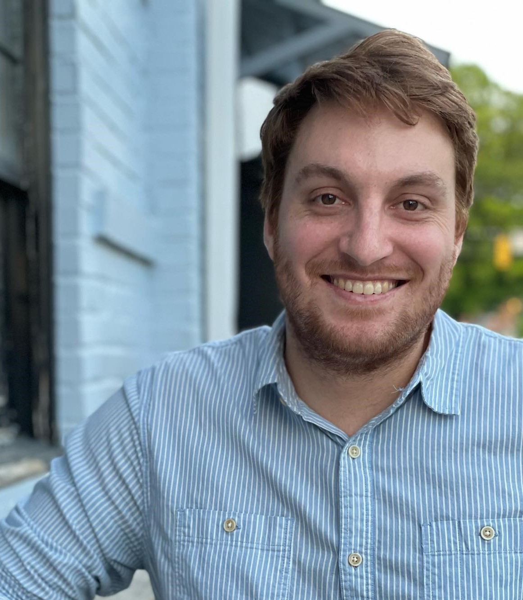

### About Me

&nbsp;&nbsp;&nbsp;&nbsp;

I am a PhD candidate in political science at the University of North Carolina at Chapel Hill. I previously received my MA in political science from UNC in 2020 and a BA in international studies from Pepperdine University. 

I specialize in international political economy, with a particular focus on international taxation. My research examines new forms of tax cooperation from systemic, state, and individual perspectives. I also study other forms of international fiscal politics, including the behavior of sovereign wealth funds. 

{::comment}
In my spare time, you may find me trying to keep up with a vivacious two-year old, idling on a couch, reading novels, or desperately trying to stay awake while watching my West Coast sports teams play in Eastern Time. 
{:/comment}
